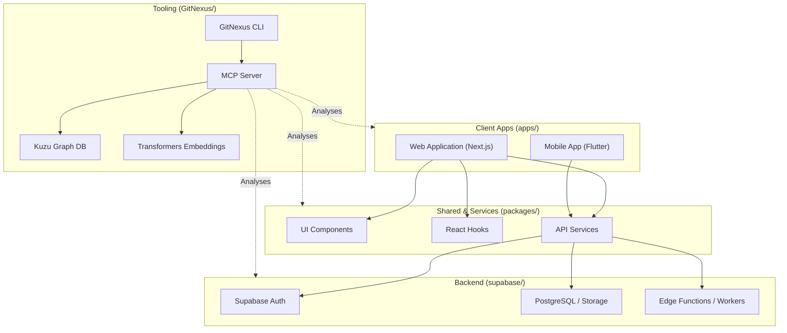

# Architecture Overview

This document provides a high-level overview of the repository structure, key functional areas, entry points, and execution flows based on GitNexus knowledge graph analysis.

## 1. Repository Map

The repository is structured as a monorepo containing several major domains:

- **apps/**: Contains the main user-facing applications.
  - **web/**: Next.js/React web application. Key clusters: `Components`, `Hooks`.
  - **mobile/**: Flutter mobile application. Key clusters: `Screens`, `Services`, `Providers`.
- **packages/**: Shared logic, types, and internal libraries.
- **supabase/**: Backend configuration, database schemas, and edge functions. Key clusters: `Storage`, `Workers`.
- **GitNexus/**: Custom codebase indexing and analysis tooling. Key clusters: `Ingestion`, `Cli`, `Local`, `Kuzu`, `Wiki`, `Embeddings`.

## 2. Functional Areas (Clusters)

Based on structural analysis, the codebase organizes into several distinct functional areas:

- **Ingestion & Analysis**: Handles codebase parsing, embedding generation, and knowledge graph construction (`Ingestion`, `Embeddings`, `Wiki`).
- **Core Storage**: Database implementations and interactions (`Storage`, `Kuzu`).
- **Web UI Layer**: Reusable frontend elements and abstractions (`Components`, `Hooks`, `Pages`).
- **Mobile UI Layer**: Mobile-specific interfaces and interactions (`Screens`, `Widgets`).
- **Backend & Services**: Business logic and background processing (`Services`, `Workers`).
- **CLI Tooling**: Command-line interfaces and local servers (`Cli`, `Local`).

## 3. Key Entry Points

The application has several primary entry points mapped to distinct execution flows:

- **Web Storefront (`apps/web`)**:
  - Next.js application serving the public-facing store and admin dashboard.
  - Entry: `apps/web/src/app/[locale]/page.tsx` (storefront), `apps/web/src/app/[locale]/admin/` (admin).
  - Auth flow: `apps/web/src/middleware.ts` → Supabase Auth → role-based routing.
- **Mobile App (`apps/mobile`)**:
  - Flutter application for iOS/Android.
  - Entry: `apps/mobile/src/app.dart` → navigation to screens.
  - Data layer: hooks in `apps/mobile/src/hooks/` → Supabase client queries.
- **Edge Functions (`packages/supabase/supabase/functions/`)**:
  - Serverless backend logic for checkout, payments, and webhooks.
  - Key functions: `create-checkout-session`, `create-cod-order`, `stripe-webhook`, `paymob-webhook`, `create-paymob-order`.
- **Database RPCs & Server Logic (`supabase/functions/`)**:
  - Secondary Edge Functions location: `create_order` (uses `place_order_transaction` RPC).
  - Migrations: `packages/supabase/supabase/migrations/`.

## 4. Architecture Diagram

